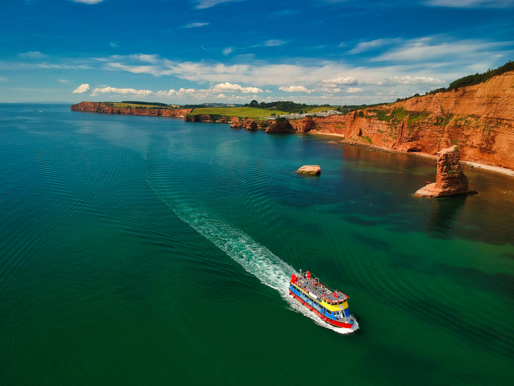

> High Peak, Otterton, Sidmouth, UK
Cruisin' On A Sunny Afternoon - A sightseeing cruiser traces through clear Summer shallows off the Jurassic Coast, Devon, UK. Photo by <a href="https://unsplash.com/@redzeppelin?utm_source=unsplash&utm_medium=referral&utm_content=creditCopyText">Red Zeppelin</a> on <a href="https://unsplash.com/t/travel?utm_source=unsplash&utm_medium=referral&utm_content=creditCopyText">Unsplash</a>
  
# HTML y CSS

El objetivo de este ejercicio es conocer la estructura de un documento HTML así como de los principales elementos. También, los fundamentos para creaciones de estilos utilizando CSS.

## Entregable

- Código fuente en este repositorio
